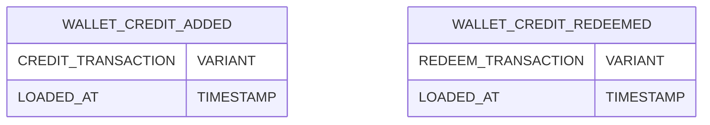

## Assumtions
1. **Snowflake** is used as the data warehouse. 


2. Raw data is ingested as JSON payloads, as described in the assignment.  

   Two source tables are assumed:

    a. **wallet_credits_added**  
    ```sql
    CREATE TABLE wallet_credits_added (
        credit_transaction VARIANT,
        loaded_at TIMESTAMP_NTZ DEFAULT CURRENT_TIMESTAMP
    )
    ```

    b. **wallet_credits_redeemed**
    ```sql
    CREATE TABLE wallet_credits_added (
        credit_transaction VARIANT,
        loaded_at TIMESTAMP_NTZ DEFAULT CURRENT_TIMESTAMP
    );
    ```
    Default timestamp here is used for loading incrementally in the staging and downstream layers.


    Defined in source.yml:
    


3. Since its not specified how a wallet is redeemed, we assume here that the ***credits that are expiring first are consumed first***.

    This assumtion helps simplify ***"redemption allocation"** and help maintain credits usage (fully/ partially consumed) accurately.


## ER Diagram
