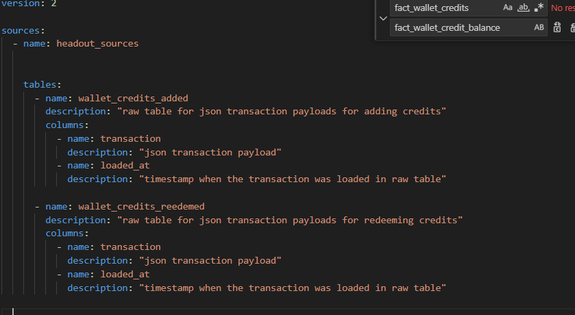
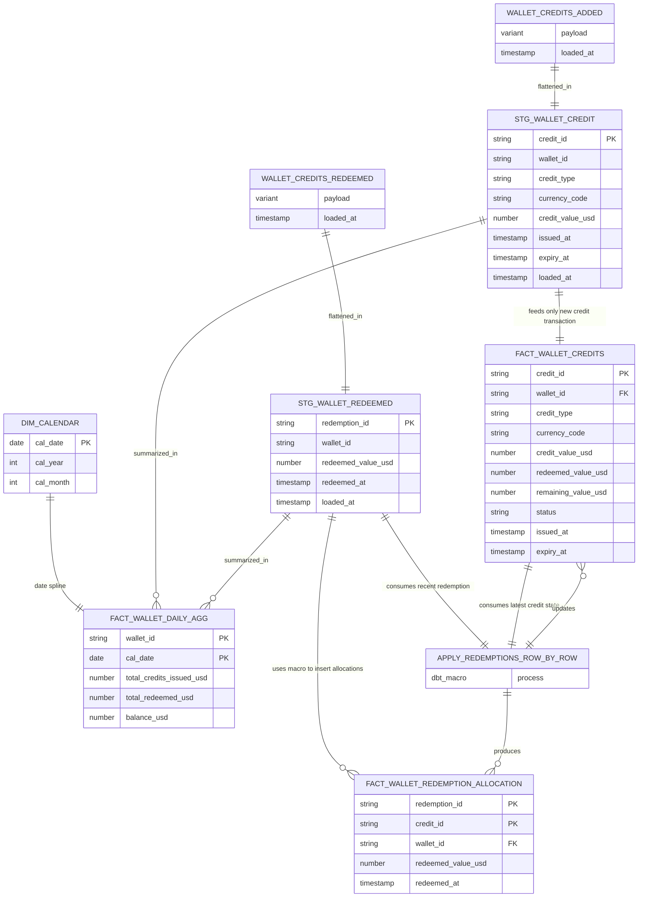

## Assumtions
1. **Snowflake** is used as the data warehouse. 


2. Raw data is ingested as JSON payloads, as described in the assignment.  

   Two source tables are assumed:

    a. **wallet_credits_added**  
    ```sql
    CREATE TABLE wallet_credits_added (
        credit_transaction VARIANT,
        loaded_at TIMESTAMP_NTZ DEFAULT CURRENT_TIMESTAMP
    )
    ```

    b. **wallet_credits_redeemed**
    ```sql
    CREATE TABLE wallet_credits_added (
        credit_transaction VARIANT,
        loaded_at TIMESTAMP_NTZ DEFAULT CURRENT_TIMESTAMP
    );
    ```
    Default timestamp here is used for loading incrementally in the staging and downstream layers.


    Defined in source.yml:
    


3. Since its not specified how a wallet is redeemed, we assume here that the ***credits that are expiring first are consumed first***.

    This assumtion helps simplify ***"redemption allocation"** and help maintain credits usage (fully/ partially consumed) accurately.


## ER Diagram


## Business Questions

1. What is the current total balance of all credits in the Headout wallet service?

    Ans:
    After the macro "***redemption_allocation_macro***" is ran, ***fact_wallet_credit_balance*** represents the latest state for each credit transaction after redemptions are applied.
    Summing on the **remaining_value_usd** gives us the current balance in credits.

    ```sql

    select 
        sum(remaining_value_usd) as balance
    from {{ref(fact_wallet_credit_balance)}}

    ```

2. What is the balance of each credit type (cancellation, goodwill, gift_card)?

    Ans:
    Extending on above, we can add more granularity to the query to get the desired result.
    Sum over **credit_type** will gives the current balance on each type.

    ```sql

    select 
        distinct credit_type,
        sum(remaining_value_usd) as balance
    from {{ref(fact_wallet_credit_balance)}}

    ```

3. What is the daily total wallet balance over time?

    Ans:
    [***fact_wallet_daily_agg***](headout/models/fact_dimensions/fact_wallet_daily_agg.sql) aggregates rolling sum of **credits added** and **redeemed** to each wallet. 
    Ultimately giving the change in balance for each wallet every day.

     ```sql

    select
        cal_date,
        wallet_id,
        total_credits_issued_usd,
        total_redeemed_usd,
        wallet_balance_usd,
    from {{ref('fact_wallet_daily_agg')}}
    where wallet_id = "xyz"

    ```