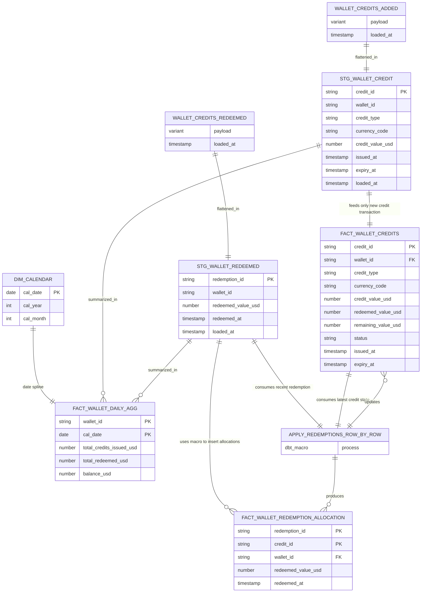

## Assumtions
1. **Snowflake** is used as the data warehouse. 
    & ***dbt core** is used to build out models, dependencies and macros.


2. Raw data is ingested as JSON payloads, as described in the assignment.  

   Two source tables are assumed:

    a. **wallet_credits_added**  
    ```sql
    CREATE TABLE wallet_credits_added (
        credit_transaction VARIANT,
        loaded_at TIMESTAMP_NTZ DEFAULT CURRENT_TIMESTAMP
    )
    ```

    b. **wallet_credits_redeemed**
    ```sql
    CREATE TABLE wallet_credits_added (
        credit_transaction VARIANT,
        loaded_at TIMESTAMP_NTZ DEFAULT CURRENT_TIMESTAMP
    );
    ```
    Default timestamp here is used for loading incrementally in the staging and downstream layers.


    Defined in source.yml:
    


3. Since its not specified how a wallet is redeemed, we assume here that the ***credits that are expiring first are consumed first***.

    This assumtion helps simplify ***"redemption allocation"** and help maintain credits usage (fully/ partially consumed) accurately.


## ER Diagram


## Business Questions

1. What is the current total balance of all credits in the Headout wallet service?

    Ans:
    After the macro [***redemption_allocation_macro***](headout/macro/redemption_allocation_macro.sql) is ran, [***fact_wallet_credit_balance***](headout/models/fact_dimensions/fact_wallet_credit_balance.sql) represents the latest state for each credit transaction after redemptions are applied.
    Summing on the **remaining_value_usd** gives us the current balance in credits.

    ```sql

    select 
        sum(remaining_value_usd) as balance
    from {{ref(fact_wallet_credit_balance)}}

    ```

2. What is the balance of each credit type (cancellation, goodwill, gift_card)?

    Ans:
    Using [***fact_wallet_credit_balance***](headout/models/fact_dimensions/fact_wallet_credit_balance.sql)
    Extending on above, we can add more granularity to the query to get the desired result.
    Sum over **credit_type** will gives the current balance on each type.

    ```sql

    select 
        distinct credit_type,
        sum(remaining_value_usd) as balance
    from {{ref(fact_wallet_credit_balance)}};

    ```

3. What is the daily total wallet balance over time?

    Ans:
    [***fact_wallet_daily_agg***](headout/models/fact_dimensions/fact_wallet_daily_agg.sql) aggregates rolling sum of **credits added** and **redeemed** to each wallet. 
    Ultimately giving the change in balance for each wallet every day.

     ```sql

    select
        cal_date,
        wallet_id,
        total_credits_issued_usd,
        total_redeemed_usd,
        wallet_balance_usd,
    from {{ref('fact_wallet_daily_agg')}}
    where wallet_id = "xyz";

    ```
4. What is the average wallet balance per user for any given day?

    Ans:
    Again using [***fact_wallet_daily_agg***](headout/models/fact_dimensions/fact_wallet_daily_agg.sql) we can calculate this by aggregation by ***avg(wallet_balance_usd)** over each day  

     ```sql

    select
        cal_date,
        avg(wallet_balance_usd)
    from {{ref('fact_wallet_daily_agg')}};
    
    ```

5. How much credit value is scheduled to expire in the next month?

    Ans:
    Using [***fact_wallet_credit_balance***](headout/models/fact_dimensions/fact_wallet_credit_balance.sql) again,
    which gives us the latest state of each credit transaction after redemptions are applied.

    ```sql
    select
        sum(remaining_value_usd)
    from {{ref('fact_wallet_credit_balance')}}
    where 
        status in ('active', 'partially_redeemed')
        and extract(month from expiry_at) = 10
        and extract(year from expiry_at) = 2025;
    
    ```

6. For credits granted in a specific month (e.g., March 2025), what is their outcome 3
    months later (i.e., % redeemed, % expired, and % still available)?

    Ans:
    Again we can use [***fact_wallet_credit_balance***](headout/models/fact_dimensions/fact_wallet_credit_balance.sql)
    here.

    we can get the current status of the credits that were issued 3 monts ago:

    ```sql
    with current_status_counts (
        select
            sum(case when status in ('active', 'partially_redeemed') and expiry_at > now() then 1) as total_active
            , sum(case when status in 'redeemed' then 1) as total_redeemed
            , sum(case when remaining_value_usd >0 and expiry_at < now() then 1) as total expired

        from {{ref('fact_wallet_credit_balance')}}
        where extract(month from issued_at) = 6 
        --3 months ago
    )

    select
        total_active / (total_active + total_redeemed + total_expired) as precent_active
        , total_redeemed / (total_active + total_redeemed + total_expired) as precent_redeemed
        , total_expired / (total_active + total_redeemed + total_expired) as precent_expired
    from 
        current_status_count
    
    ```

    And we can take these snapshots and store them over time to have a historical view of how the credits were used.

